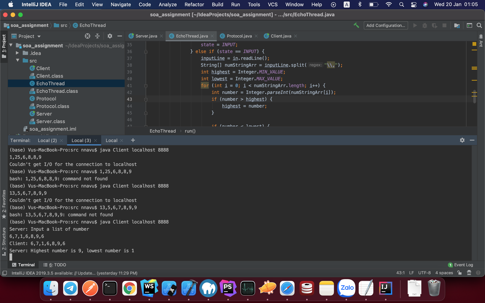

# Week 1

Cách chạy:

- Chạy `javac Server.java` và `java Server <port>`
- Chạy `javac Client.java` và chạy `java Client localhost <port>` ở một terminal khác
- Điền các số, cách nhau bằng dấu ",". Ví dụ: "1,3,5,7,8,9,0"

Kết quả: 
- Chạy server

- Chạy Client

