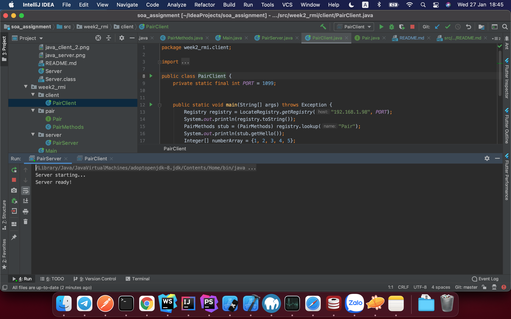
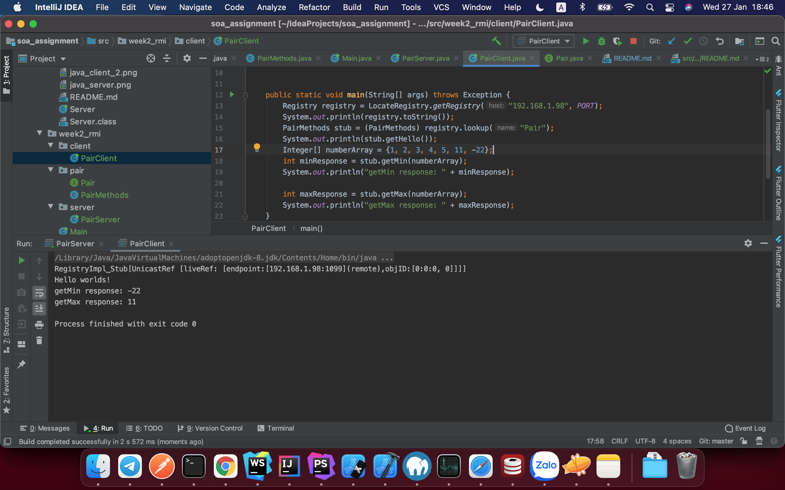

# Week 2 - RMI

Cách chạy:

- Chạy `javac server/PairServer.java` và `java PairServer`
- Chạy `javac client/PairClient.java` và chạy `java PairClient` ở một terminal khác

Hoặc:
- Mở project trong IntelliJ/Eclipse
- Run file `server/PairServer.java` và `client/PairClient.java`

Kết quả: 
- Chạy server

- Chạy Client, ở đây array interger input là: [1, 2, 3, 4, 5, 11, -22]
